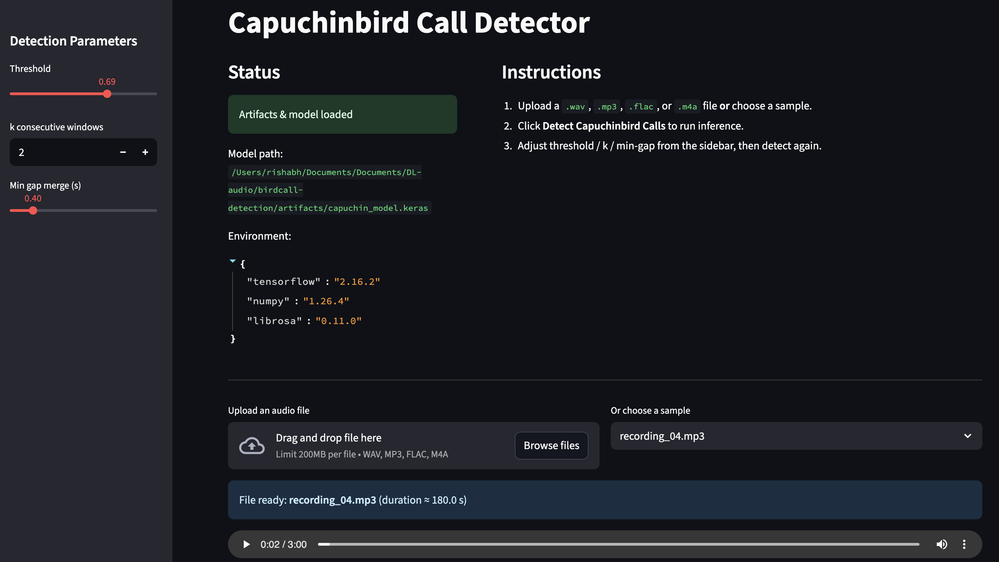
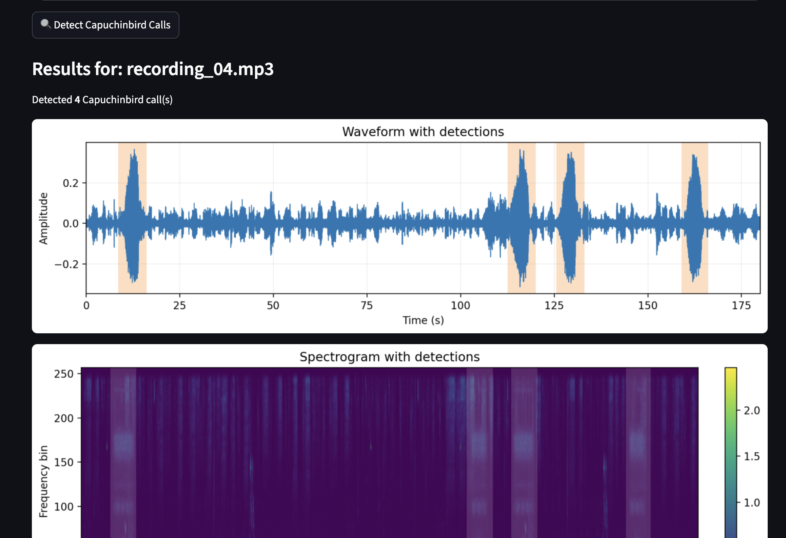
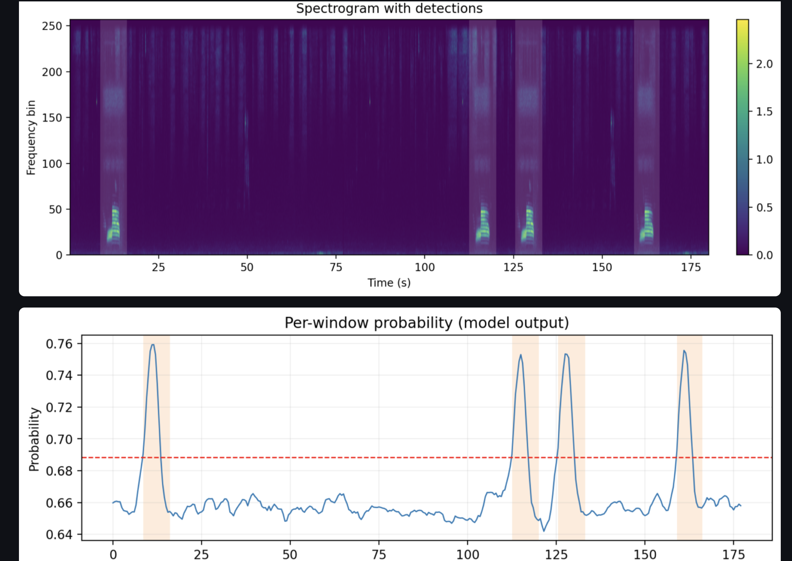
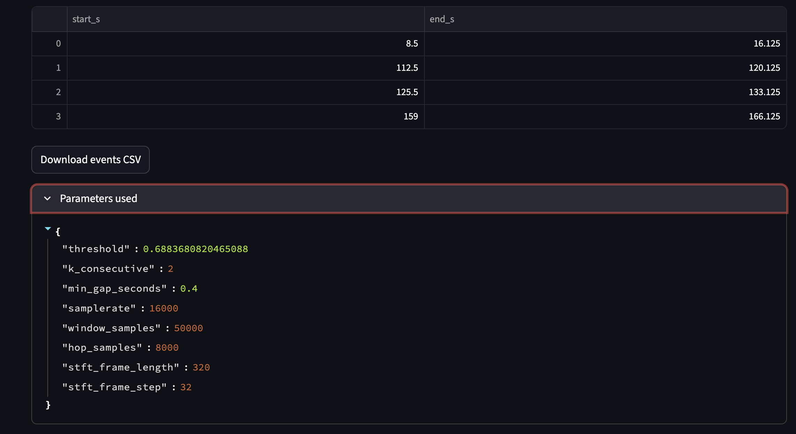

# Capuchinbird Call Detector 🎶🦜

A deep learning–powered tool for detecting **Capuchinbird calls** in audio recordings.  
Built with TensorFlow, Streamlit, and signal processing techniques, this project lets you upload or select audio samples, run real-time inference, and visualize detected bird calls with waveform plots, spectrograms, and probability curves.

---

## 📸 Screenshots

### App Overview & Controls


### Detection Results & Visualizations


### Spectrograms & Probability Curve


### Parameters & CSV Export


---

## ✨ Features
- Upload `.wav`, `.mp3`, `.flac`, or `.m4a` files, or choose from built-in sample recordings.
- Adjustable **detection parameters**: threshold, consecutive windows, and min-gap merging.
- Rich **visualizations**:
  - Waveform with highlighted detections
  - Spectrogram with detected spans
  - Per-window probability curves
- Download detected events as a **CSV** file.
- Built with **TensorFlow on Apple Silicon** (MPS) for fast local inference.


---

## 🧠 Model & Performance

The detection model is a lightweight **2D CNN** trained on spectrograms of audio windows:

- **Architecture**: 2 Conv2D layers → Flatten → Dense (ReLU) → Dense (Sigmoid)  
- **Parameters**: ~28K (tiny, fast to run locally, even on CPU/MPS)  
- **Input**: STFT magnitude spectrograms of 50,000-sample (~3s) windows  
- **Output**: Probability of Capuchinbird call in each window  

### Training
- **Dataset**: Positive (Capuchinbird calls) vs. Negative (other sounds) audio clips  
- **Augmentations**: Basic slicing, padding, overlapping windows  
- **Optimizer**: Adam (lr=0.001 with decay)  
- **Class imbalance** handled with **class weights**  

### Performance (Validation Set)
- **Best AUC**: ~0.98  
- **Best F1-score**: ~0.90 @ threshold ≈ 0.68  
- **Precision/Recall tradeoff** adjustable at inference with threshold slider  

The model is designed to **favor recall** (i.e., rarely miss true calls) while still keeping precision reasonable.  
Post-processing with **k-consecutive window filtering** and **min-gap merging** reduces false positives from short noise bursts.

---

## 🚀 Getting Started

### 1. Clone the repository
```bash
git clone https://github.com/your-username/capuchinbird-call-detector.git
cd capuchinbird-call-detector
````

### 2. Set up environment

We recommend using conda or venv:

```bash
conda create -n birdcall python=3.10
conda activate birdcall
```

Install dependencies:

```bash
pip install -r requirements.txt
```

For development & testing:

```bash
pip install -r requirements-dev.txt
```

### 3. Run the app

```bash
streamlit run app/streamlit_app.py
```

Open your browser at [http://localhost:8501](http://localhost:8501).

---

## 📂 Project Structure

```
birdcall-detection/
│
├─ app/                  # Streamlit app (UI)
│   └─ streamlit_app.py
├─ src/                  # Core modules (audio, features, inference, viz)
├─ artifacts/            # Saved model & configs
├─ samples/              # Demo audio files
├─ tests/                # Unit tests (pytest)
├─ requirements.txt      # Runtime dependencies
├─ requirements-dev.txt  # Dev/test dependencies
└─ README.md
```

---

## 🧪 Testing

Run sanity tests with:

```bash
pytest -q
```

---

## 📜 License

MIT License © 2025 Your Name

---

## 🌟 Acknowledgements

* TensorFlow team for Apple Silicon support
* Streamlit for rapid UI prototyping
* Inspiration from real-world ecoacoustics & birdcall monitoring

---

